# Hospital Appointment System
## Introduction
This is an hospital appointment management back-end system, created using Java Spring Boot, that could be linked to a front-end to make API calls to an hospital database.
It has various CRUD (Create, Read, Update, Delete) functionalities to maintain the system and keep it updated.
It is split into two tables. A table for patients and a table for appointments. 
This system is designed for companies to make it more convenient for them to store, update and maintain appointment data as well as patient data.
This README provides an overview of its functionality as well as instructions on how to run it using Spring Boot.

## Features
* Add patient
* View all patients
* Update patients
* Delete patient by appointment no
* View patient by appointment no
* View patient by patient name
* Add appointments
* View all appointments
* Update appointment
* Delete appointment
* View appointment by appointment number
* View appointment by doctor name
 
 ## Project Structure

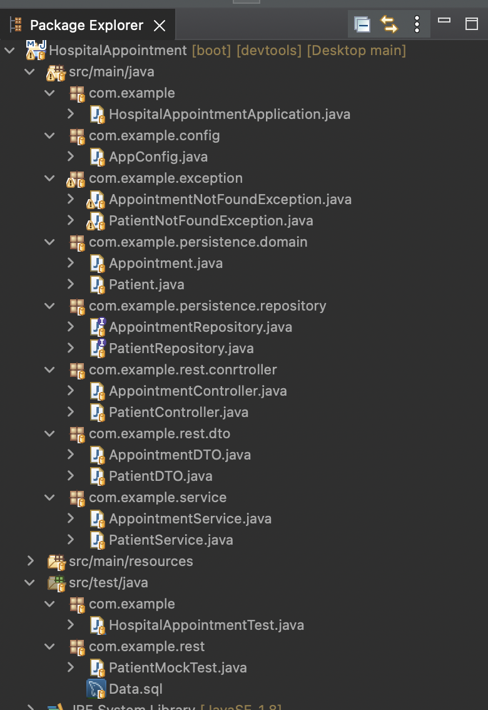

## Database:
Below is an ERD diagram for the database tables:

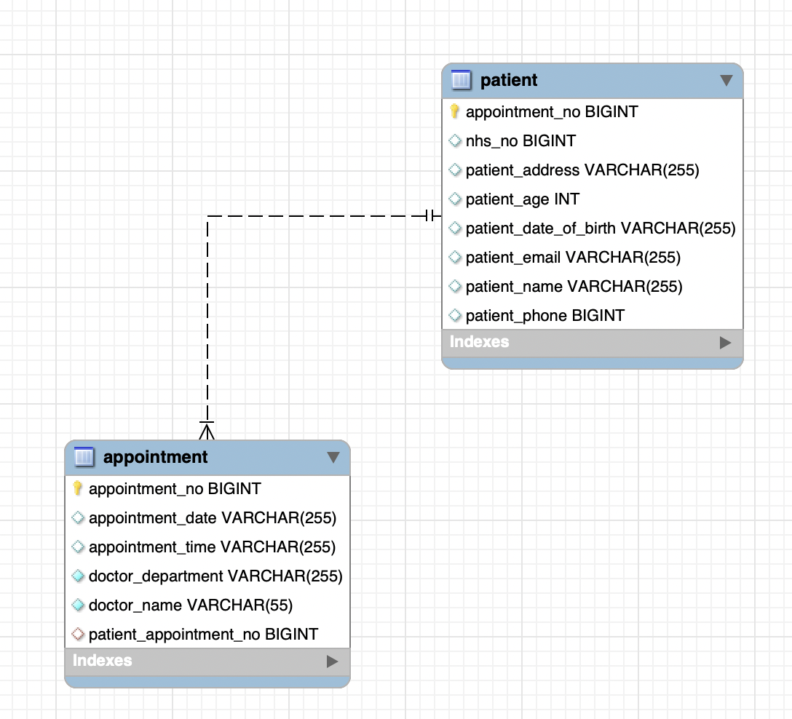
As you can see the tables can be linked together through the Appointment Number.

## Execution using Postman - CRUD

#### CREATE: Adding Patient:

	        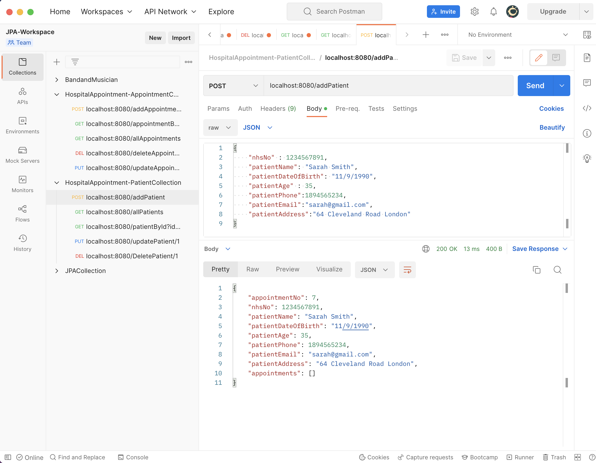

 
#### READ: Getting all the patients:		 

	        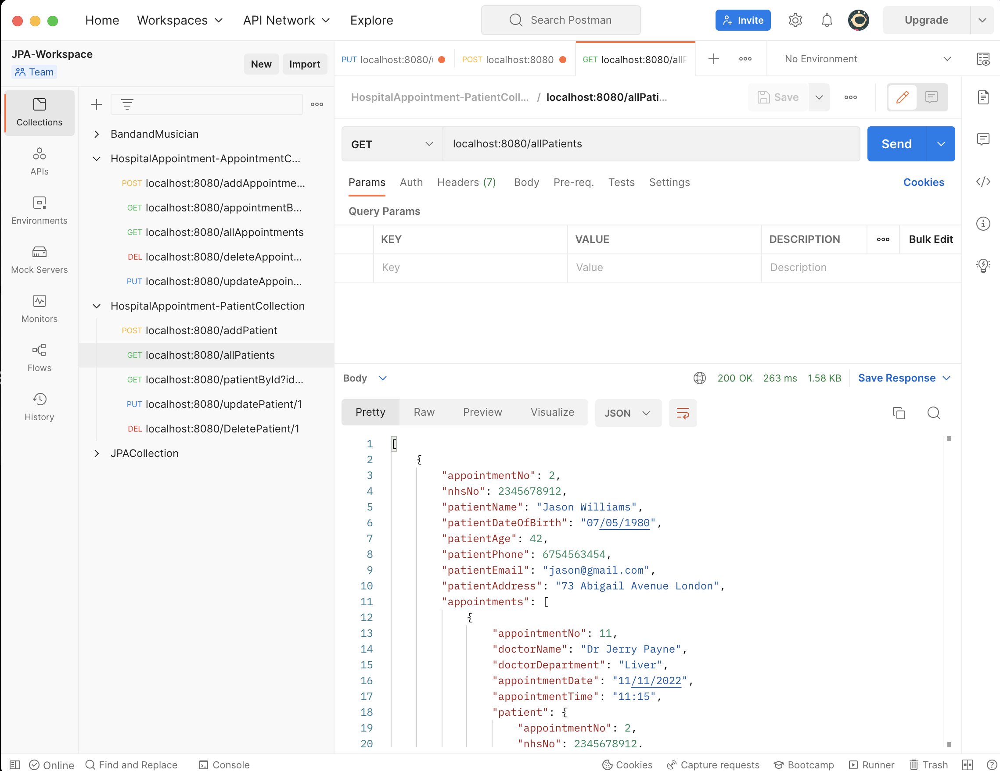

 
#### UPDATE: Updating patient:

	        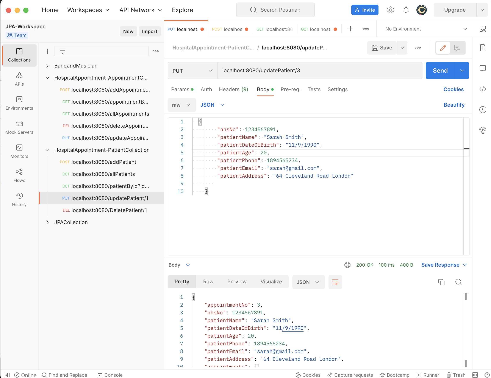

 
#### DELETE: Deleting patient:

	        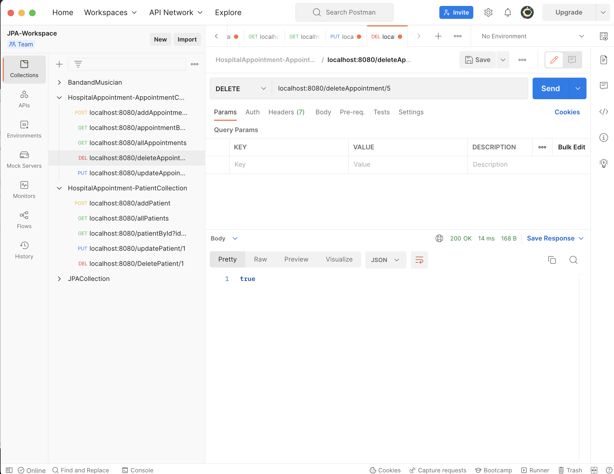

 
#### CREATE: Adding Appointment:

	        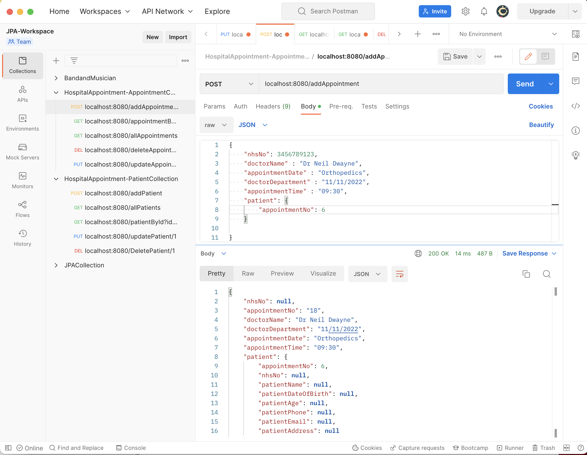

#### READ: Getting all the appointments:

	        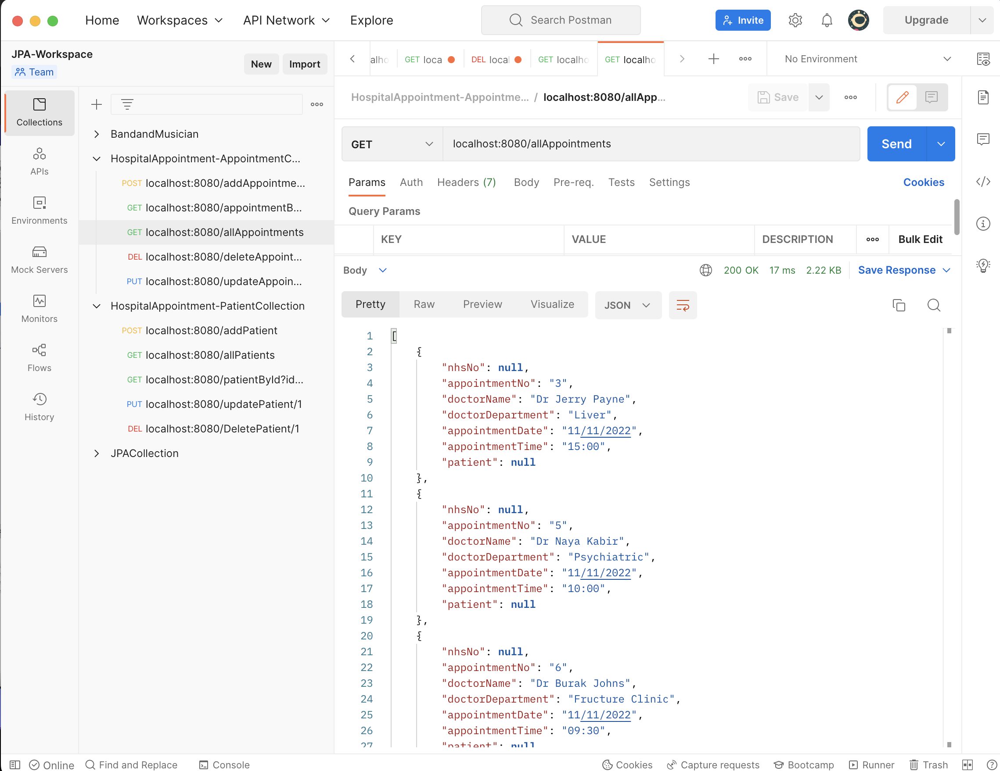

#### UPDATE: Updating appointment:

	        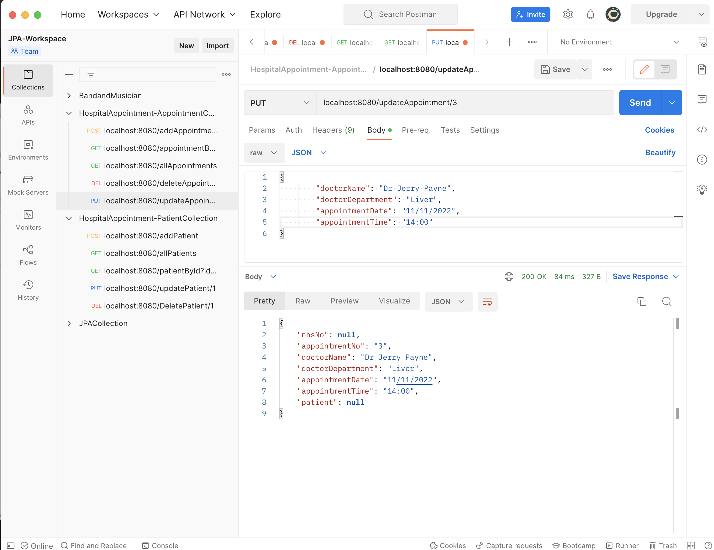

#### DELETE: Deleting appointment:

	        

## Executing on Spring Boot
Since this is a Spring Boot application it uses a TomCat server.
The port number used is 8080, so make sure that port remains free.
Once you have opened the project, you can right click and there are two ways to run it:
Run as Java Application,
Run as Spring Boot App.
After this, you can run the CRUD operations using something like Postman as shown above.

## Testing
As you can see on the picture below, different types of tests were carried out on the functionality of the system and were pass.
These were done using Mockito and JUnit testing.

	        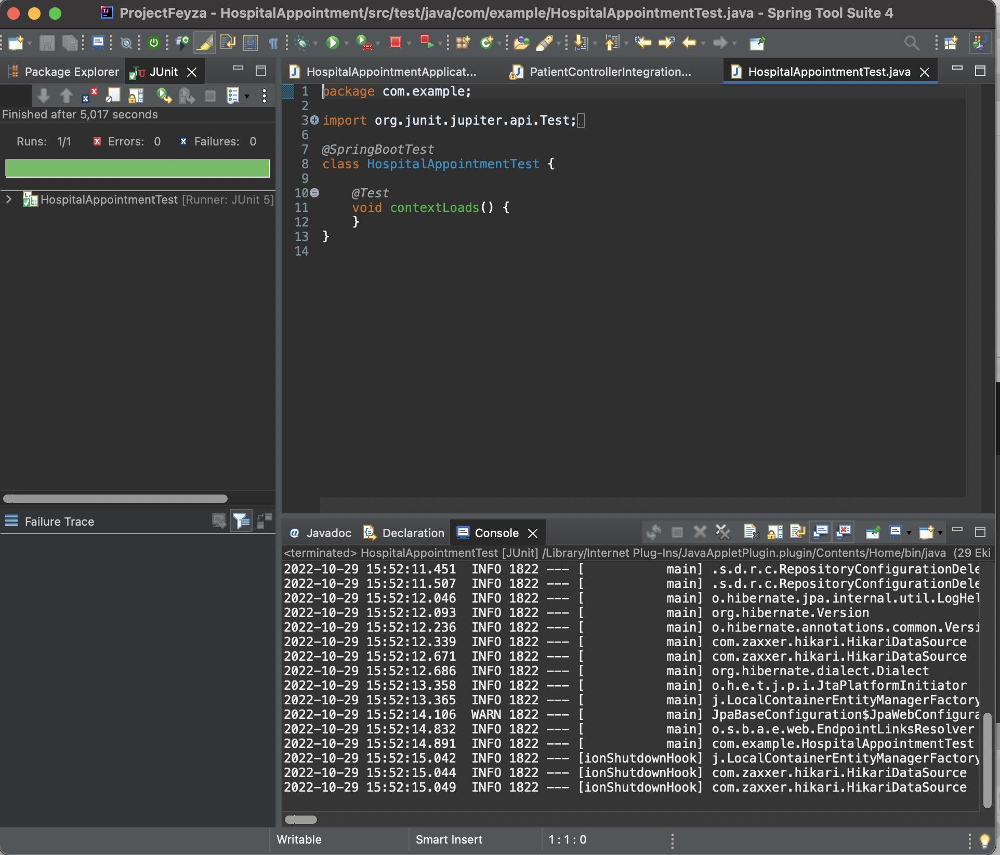

	        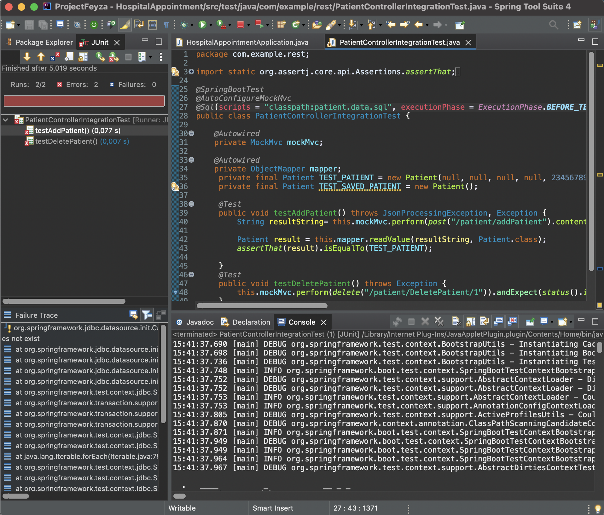

## What I learned from this project
In this project, I learned how to use various Java and Spring Boot
functionalities including LOMBOK, Unit testing and being able to create a back-end API that can perform CRUD operations.
It was quite challenging for me as I created my first software application.
I could develop this application in a very short period of time due to the deadline. 
I am considering developing my application further as I really enjoyed having developed an application that works.
I will improve my project and add more features to the application in the future.
